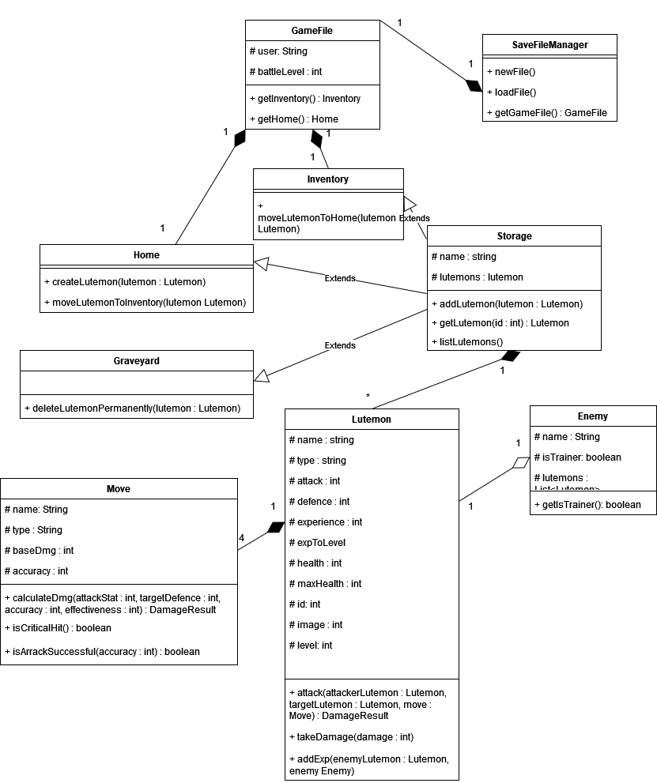

Kesällä 2023 suoritettu LUT olio-ohjelmoinnin harjoitustyö. Sovellus on tehty Android studiolla ja se pyrkii muistuttamaan Pokemonia. Esitteylyvideo: https://youtu.be/o6ZoeBeZZP0
Tarkempi sovelluksen kirjallinen kuvaus löytyy "olio_suunnitelma.pdf"-tiedostosta.

Alla on luokkakaavio, joka havainnollistaa osaa sovelluksen luokkien toimintaperiaatteista. (Puuttuu: Yksittäinen Graveyard sisältyy GameFileen, samalla tavoin kuin Inventory ja Home).

